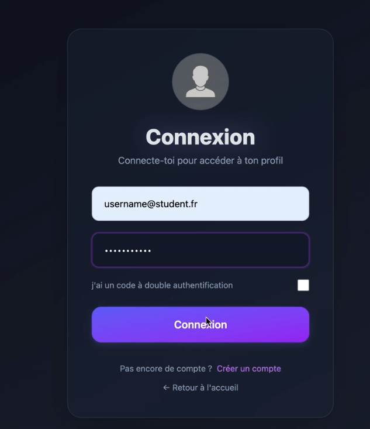
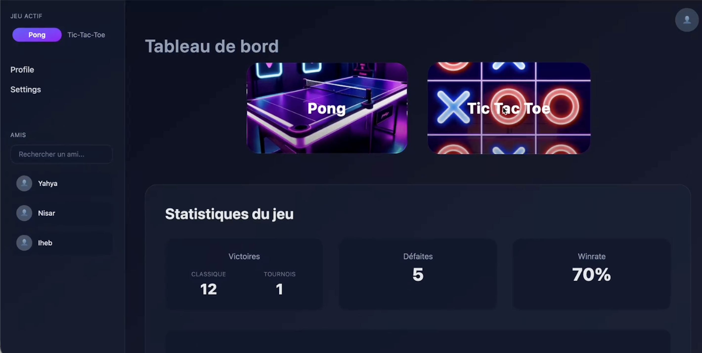
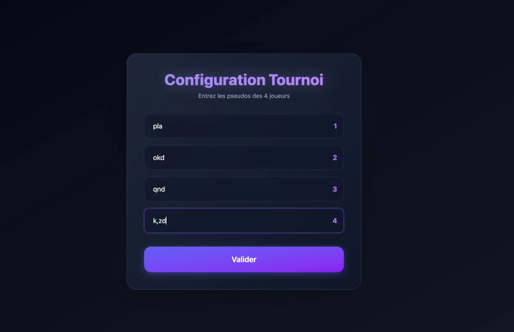

# ft_transcendence

> A production-oriented multiplayer gaming platform built at École 42

ft_transcendence is a full-stack web application designed with a focus on backend architecture, security, authentication, real-time systems, and infrastructure. Built collaboratively with clear ownership areas, my primary responsibility was the backend, platform logic, and infrastructure integration.




## Table of Contents
- [Project Summary](#-project-summary)
- [Features](#-features)
- [Tech Stack](#-tech-stack)
- [My Contributions](#-my-responsibilities--contributions)
- [Architecture](#architecture)
- [Getting Started](#getting-started)
- [Learning Outcomes](#-what-i-learned)

---

## 🎯 Project Summary

The platform allows users to:

- Create and manage secure accounts
- Authenticate with optional Two-Factor Authentication (2FA)
- Play real-time multiplayer games (Pong + additional game)
- Manage friends and social interactions
- Track match history and statistics

The application is fully containerized and structured to resemble a real production system.

## 🧪 Features

- **User Management**: Account creation, profile management, avatar uploads
- **Authentication**: JWT-based auth with HTTP-only cookies + TOTP 2FA
- **Social System**: Friends, friend requests, blocking
- **Real-Time Gaming**: Multiplayer Pong and additional game with tournament support
- **Statistics**: Match history, player stats, leaderboards
- **Infrastructure**: Docker/Docker Compose for reproducible environment

### Cross-Team Collaboration

- Worked closely with frontend developers
- Defined API contracts and payload formats
- Debugged frontend/backend integration issues
- Ensured authentication, cookies, and session handling worked correctly

## 🛠 Tech Stack

| Layer | Technology |
|-------|-----------|
| **Backend** | Node.js, Fastify |
| **Database** | SQLite |
| **Authentication** | JWT, TOTP (2FA) |
| **Frontend** | TypeScript, Vite, Tailwind CSS |
| **Game Service** | Real-time multiplayer service |
| **Infrastructure** | Docker, Docker Compose |

## 🚀 Getting Started

### Prerequisites
- Docker & Docker Compose
- Node.js 16+ (for local development)
- Make (for running commands)

### Setup & Installation

```bash
# Clone the repository
git clone <repo-url>
cd transcendence

# Build and start all services
make all

# Or use docker-compose directly
docker-compose up --build
```

### Environment Configuration
Create a `.env` file in the root directory with required configuration:

```env

# JWT Secret
JWT_SECRET=your_secret_key

```

### Database Setup
The database initializes automatically on first run. To reset:

```bash
cd GAME/backend
rm database.db
node db/init.js
```

## Architecture

### Project Structure
```
├── frontend/               # Frontend application
│   └── ft_front/          # Vite + TypeScript
└── Game/ 
    ├── backend/                 # Fastify API server
    │   ├── controllers/        # Request handlers
    │   ├── db/       
    │   ├── routes/             # API endpoints
    │   ├── middleware/         # Auth, CORS, etc.
    │   ├── db/                 # Database & schema
    |   ├── database.db 
    │   └── utils/              # Helpers (JWT, validation)
    ├── games/                  # Game services
    │   ├── pong/
    │   └── tictactoe/
├── docker-compose.yml      # Service orchestration
├── Makefile               # Common commands
```

### Key Design Decisions
- **Separation of Concerns**: Controllers, services, and data layers clearly separated
- **Security First**: HTTP-only cookies, CORS protection, input validation
- **Containerization**: Each service in its own container for isolation
- **Database Design**: Normalized schema supporting all features with referential integrity

## 📚 What I Learned

- How to design a real backend architecture, not just endpoints
- Secure authentication flows for SPAs using cookies and JWTs
- Implementing 2FA and understanding real security trade-offs
- Structuring APIs for long-term maintainability
- Managing stateful real-time systems and match lifecycles
- Designing database schemas that evolve with features
- Working in a multi-service, containerized environment
- Collaborating effectively across frontend, backend, and game logic

## 📌 Project Context

This project was built under **École 42 constraints**, emphasizing:

- **Autonomy and Ownership**: Clear responsibility areas, independent decision-making
- **Production-Style Architecture**: Real-world patterns and best practices
- **Security and Reliability**: Focus on secure authentication and data protection.
- **Team Collaboration**: Coordinating across multiple specialists under real deadlines
